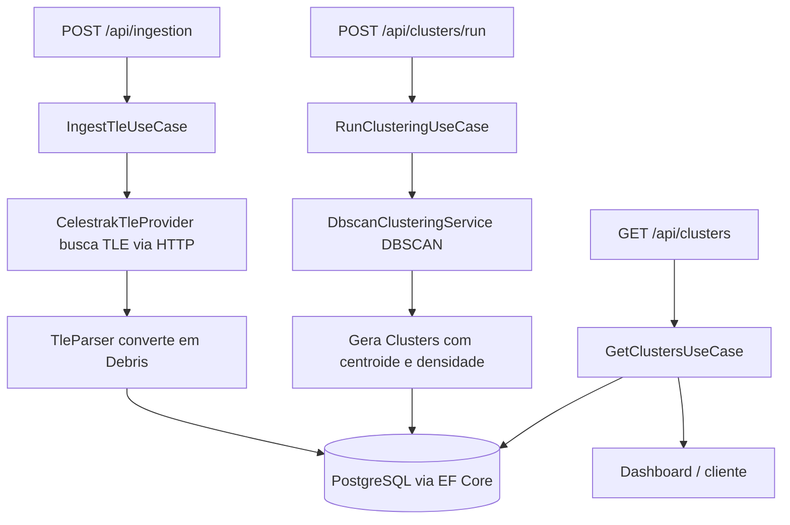

# Garimpo Espacial - Backend

API REST de inteligencia de detritos espaciais. O backend ingere dados publicos de
detritos orbitais no formato **TLE (Two-Line Element)** da **Celestrak/NORAD**, aplica o
algoritmo de agrupamento espacial **DBSCAN** para identificar zonas de alta densidade de
lixo espacial na **Orbita Baixa da Terra (LEO)** e expoe esses aglomerados via API
documentada com Swagger.

## Motivacao

O acumulo de detritos em LEO ameaca satelites ativos e pode desencadear a **Sindrome de
Kessler** (colisoes em cadeia). Mapear onde o lixo se concentra permite:

- **Otimizar recursos**: rotas de coleta/remocao com menor consumo de combustivel.
- **Mitigar riscos**: prevenir colisoes protegendo infraestrutura critica.
- **Apoiar decisao**: visualizar zonas de risco para planejar trajetorias seguras.

## Stack

- ASP.NET Core (.NET 9) - API REST
- Entity Framework Core + Npgsql - ORM
- PostgreSQL 16 - persistencia
- Swashbuckle (Swagger / OpenAPI) - documentacao
- Docker / Docker Compose - orquestracao (raiz + por aplicacao)
- Seguranca: JWT Bearer, BCrypt, rate limiting, security headers, auditoria

## Documentacao por disciplina

| Disciplina | Documento |
| --- | --- |
| Arquitetura | [docs/ARCHITECTURE.md](docs/ARCHITECTURE.md) |
| Cybersecurity | [docs/CYBERSECURITY.md](docs/CYBERSECURITY.md) |
| C# / OOP | Este README + codigo em `src/Domain` |

## Arquitetura (Hexagonal + Clean Architecture)

A solucao separa o nucleo de negocio das tecnologias externas atraves de **portas**
(interfaces na camada de Aplicacao) e **adapters** (implementacoes na Infraestrutura).
A regra de dependencia aponta sempre para dentro: nada no dominio conhece EF Core, HTTP
ou ASP.NET.

```
Api  ->  Application  ->  Domain
                ^             ^
                |             |
         Infrastructure ------+   (implementa as portas / adapters)
```

| Camada | Responsabilidade | Conteudo principal |
| --- | --- | --- |
| `Domain` | Nucleo puro, sem dependencias | `Debris`, `Cluster`, hierarquia `SpaceAsset`/`Satellite`/`SensorAsset`, `Alert` polimorfico, `DbscanClusteringService`, excecoes |
| `Application` | Casos de uso e portas | `IngestTleUseCase`, `RunClusteringUseCase`, `Get*UseCase`, portas `I*Repository`, `ITleProvider`, `IClusteringService` |
| `Infrastructure` | Adapters | `GarimpoDbContext`, repositorios EF, `CelestrakTleProvider`, `TleParser`, `DbscanClusteringAdapter` |
| `Api` | Entrada HTTP | Controllers, Swagger, middleware de excecoes, DI |

### Justificativas de design (SOLID / Clean)

- **DBSCAN no Dominio**: o algoritmo e regra de negocio central (core), portanto vive no
  dominio como servico puro e testavel, exposto a aplicacao via porta `IClusteringService`
  (Inversao de Dependencia).
- **Simplificacao de posicao**: em vez de propagar a posicao 3D instantanea (SGP4), os
  detritos sao agrupados pelo **regime orbital** (altitude x inclinacao) derivado do TLE.
  E mais leve, deterministico e suficiente para mapear densidade - decisao consciente de
  trade-off documentada aqui.
- **Tratamento de excecoes especifico**: `TleParsingException`, `DebrisNotFoundException`
  e `DomainException` sao traduzidas em respostas `ProblemDetails` por um middleware, para
  que o sistema critico nao quebre abruptamente.

## Modelo de dominio

- **Debris** (detrito): entidade atomica ingerida do TLE. Guarda as linhas brutas, os
  elementos orbitais derivados (inclinacao, excentricidade, movimento medio, altitude) e a
  classificacao por faixa de orbita.
- **Cluster** (aglomerado): entidade processada que agrupa varios `Debris` numa zona de
  alta densidade, com centroide e densidade calculados. Relacao 1:N (um detrito pertence a
  no maximo um aglomerado; `null` = ruido).

## Fluxo principal



## Autenticacao (JWT)

Todos os endpoints exigem **Bearer JWT**, exceto `/api/auth/register` e `/api/auth/login`.

Usuario de teste criado automaticamente no seed (sprint Mobile):

| Email | Senha |
| --- | --- |
| `fiap@teste.com` | `123456` |

## Endpoints

| Metodo | Rota | Auth |
| --- | --- | --- |
| `POST` | `/api/auth/register` | Publico |
| `POST` | `/api/auth/login` | Publico |
| `POST` | `/api/ingestion?group={grupo}` | Bearer |
| `POST` | `/api/clusters/run` | Bearer |
| `GET` | `/api/clusters` | Bearer |
| `GET` | `/api/debris` | Bearer |
| `GET` | `/api/debris/{id}` | Bearer |
| `GET` | `/api/alerts` | Bearer |
| `POST` | `/api/alerts/evaluate` | Bearer |
| `POST` | `/api/alerts/{id}/acknowledge` | Bearer |

Grupos uteis da Celestrak: `cosmos-2251-debris`, `iridium-33-debris`, `active`.

## Configuracao de ambiente (.env)

**Obrigatorio antes de rodar.** Secrets ficam fora do Git (Cybersecurity + Arquitetura):

```bash
# Na raiz do mono-repo
cp .env.example .env
# Edite .env: troque POSTGRES_PASSWORD e Security__Jwt__Secret
```

| Variavel | Obrigatoria | Descricao |
| --- | --- | --- |
| `POSTGRES_USER` / `POSTGRES_PASSWORD` | Sim | Credenciais do banco |
| `Security__Jwt__Secret` | Sim | Secret JWT (min. 32 caracteres) |
| `ConnectionStrings__DefaultConnection` | Sim (local) | Para `dotnet run` sem Docker |
| `ExternalServices__Celestrak__BaseUrl` | Nao | Celestrak e **publica**, sem API key |
| `ExternalServices__SpaceTrack__*` | Nao | NORAD oficial (opcional, requer cadastro) |
| `EXPO_PUBLIC_API_URL` | Frontend | URL da API (token JWT vai no AsyncStorage) |

O arquivo `.env` esta no `.gitignore`. Apenas `.env.example` e versionado.

## Como executar

### Opcao 1 - Docker Compose (recomendado)

```bash
# Raiz do mono-repo (front + back + db)
cp .env.example .env   # se ainda nao fez
docker compose up --build

# Ou apenas backend + db (passa o .env da raiz)
cd backend && docker compose --env-file ../.env up --build
```

- API: `http://localhost:8080`
- Swagger: `http://localhost:8080/swagger`

### Opcao 2 - Local (.NET SDK 9)

Requer um PostgreSQL acessivel (ajuste `ConnectionStrings:DefaultConnection` em
`src/Api/appsettings.json`).

```bash
cd backend
dotnet run --project src/Api/Garimpo.Api.csproj
```

Swagger em `http://localhost:5187/swagger`.

### Migrations (EF Core)

```bash
dotnet tool install --global dotnet-ef --version 9.0.9   # uma vez
dotnet-ef migrations add NomeDaMigration \
  --project src/Infrastructure/Garimpo.Infrastructure.csproj \
  --startup-project src/Api/Garimpo.Api.csproj \
  --output-dir Persistence/Migrations
```

A migration inicial (`InitialCreate`) ja esta versionada em
`src/Infrastructure/Persistence/Migrations`.

## Fluxo de uso (passo a passo)

```bash
# 1. Login (usuario seed)
TOKEN=$(curl -s -X POST http://localhost:8080/api/auth/login \
  -H "Content-Type: application/json" \
  -d '{"email":"fiap@teste.com","password":"123456"}' | jq -r .token)

# 2. Ingerir detritos
curl -X POST "http://localhost:8080/api/ingestion?group=cosmos-2251-debris" \
  -H "Authorization: Bearer $TOKEN"

# 3. Rodar DBSCAN + gerar alertas
curl -X POST http://localhost:8080/api/clusters/run \
  -H "Authorization: Bearer $TOKEN" -H "Content-Type: application/json" \
  -d '{"epsilon":0.3,"minPoints":5}'

# 4. Consultar aglomerados e alertas
curl http://localhost:8080/api/clusters -H "Authorization: Bearer $TOKEN"
curl http://localhost:8080/api/alerts -H "Authorization: Bearer $TOKEN"
```

## Evidencias de execucao

Validado em `2026-06-06` com `docker compose up --build`:

```
# Build
dotnet build Garimpo.Backend.sln  -> Build succeeded. 0 Error(s)

# Startup (logs do container)
Applying migration '20260606011510_InitialCreate'.
Migrations aplicadas com sucesso.
Now listening on: http://[::]:8080

# Swagger
GET /swagger/index.html -> 200

# Fluxo completo
POST /api/ingestion?group=cosmos-2251-debris
-> {"fetched":588,"imported":588,"skipped":0}

POST /api/clusters/run {"epsilon":0.3,"minPoints":5}
-> {"processedDebris":588,"clustersFound":8,"noiseCount":77}

GET /api/clusters -> 8 aglomerados (maior densidade: ~4.3 em LEO ~760 km)
GET /api/debris    -> 588 detritos catalogados
GET /api/alerts    -> 6 alertas (2 Critical, demais Warning)

# Autenticacao JWT
POST /api/auth/login (fiap@teste.com / 123456) -> token JWT
GET /api/clusters (sem token) -> 401 Unauthorized
GET /api/clusters (com Bearer) -> 200 OK
Seed: usuario fiap@teste.com criado no startup
```

## Estrutura de pastas

```
backend/
  src/
    Domain/          # entidades, value objects, DBSCAN, excecoes
    Application/     # casos de uso, portas, DTOs
    Infrastructure/  # EF Core, repositorios, Celestrak, migrations
    Api/             # controllers, Program.cs, Swagger, middleware
  Dockerfile
  docker-compose.yml # API + PostgreSQL
```
