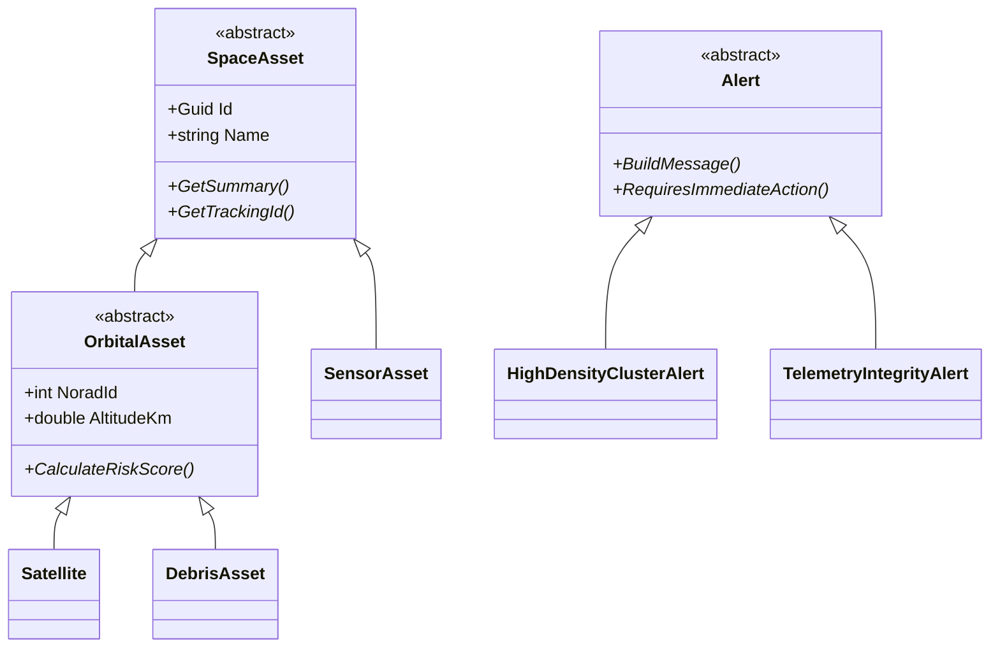
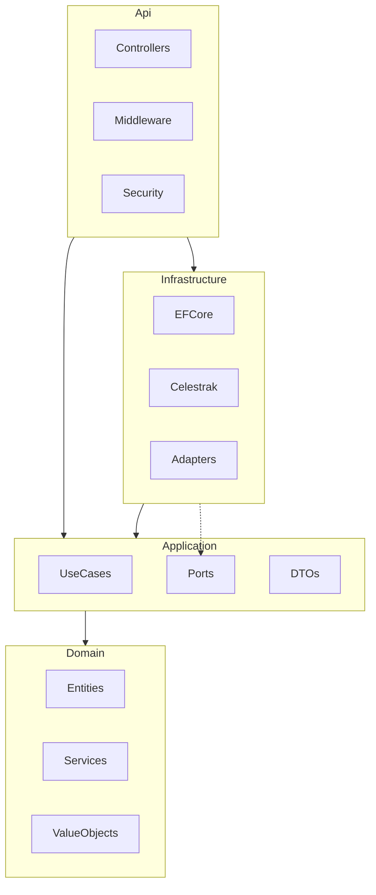
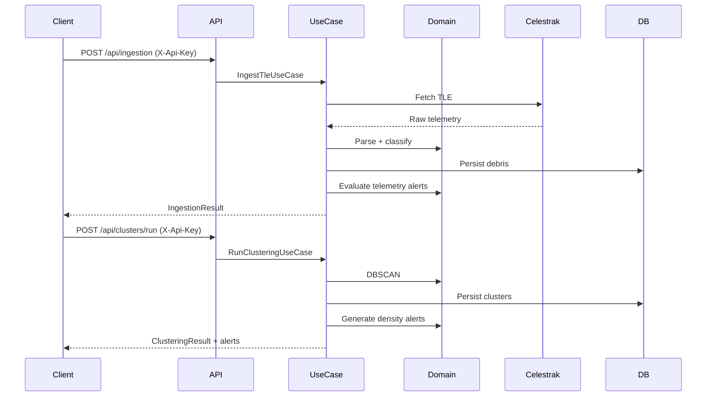

# Arquitetura - Garimpo Espacial Backend

## Visao geral

Mono-repo com backend em **ASP.NET Core 9**, **PostgreSQL 16**, **EF Core** e arquitetura **hexagonal**
(clean architecture). O dominio permanece isolado de frameworks; adapters na infraestrutura implementam
as portas definidas na aplicacao.

## Requisitos atendidos (disciplina Arquitetura)

| Requisito | Implementacao |
| --- | --- |
| Mono-repo + Docker Compose raiz | [`docker-compose.yml`](../../docker-compose.yml) orquestra db + backend + frontend |
| Compose por aplicacao | [`backend/docker-compose.yml`](../docker-compose.yml), [`frontend/docker-compose.yml`](../../frontend/docker-compose.yml) |
| Dockerfile por app | [`backend/Dockerfile`](../Dockerfile), [`frontend/Dockerfile`](../../frontend/Dockerfile) |
| Arquitetura hexagonal | 4 camadas: Domain, Application, Infrastructure, Api |
| Swagger | `/swagger` com documentacao OpenAPI |
| Heranca e polimorfismo | Hierarquia `SpaceAsset` → `OrbitalAsset` → `Satellite` / `DebrisAsset`; `SensorAsset`; `Alert` abstrato com subclasses |
| Classes abstratas | `SpaceAsset`, `OrbitalAsset`, `Alert` |
| Interfaces + DI | Portas `I*Repository`, `ITleProvider`, `ISensor`, `IClusteringService` |
| VO / DTO | `OrbitalElements`, `OrbitalCoordinate` (struct), DTOs na Application |
| Struct + Partial | `OrbitalCoordinate` (struct parcial), `Debris` (partial class para TLE) |
| WebService + Banco | API REST + PostgreSQL via EF Core |
| Tratamento de excecoes | Middleware `ExceptionHandlingMiddleware` → `ProblemDetails` |

## Hierarquia de dominio (OOP)

## Camadas e dependencias

## Fluxo de dados

## Justificativas SOLID

- **SRP**: cada use case encapsula um fluxo (ingestao, clusterizacao, alertas).
- **OCP**: novos tipos de alerta via subclasses de `Alert` sem alterar `AlertEvaluationService`.
- **LSP**: `Satellite` e `DebrisAsset` substituem `OrbitalAsset` em calculos de risco.
- **ISP**: portas granulares (`IDebrisRepository`, `IAlertRepository`) em vez de repositorio monolitico.
- **DIP**: Application depende de abstracoes; Infrastructure implementa adapters.

## Endpoints

| Metodo | Rota | Auth | Descricao |
| --- | --- | --- | --- |
| POST | `/api/ingestion` | API Key | Ingestao TLE |
| POST | `/api/clusters/run` | API Key | DBSCAN |
| GET | `/api/clusters` | Publico | Listar aglomerados |
| GET | `/api/debris` | Publico | Listar detritos |
| GET | `/api/alerts` | Publico | Listar alertas |
| POST | `/api/alerts/evaluate` | API Key | Reavaliar alertas |
| POST | `/api/alerts/{id}/acknowledge` | API Key | Reconhecer alerta |
