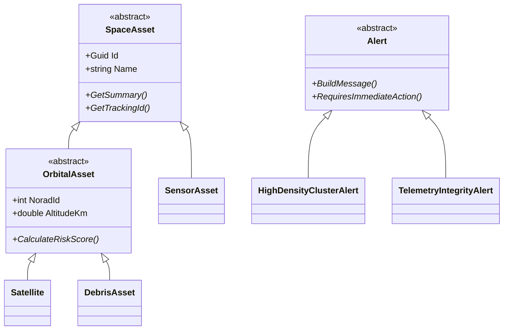
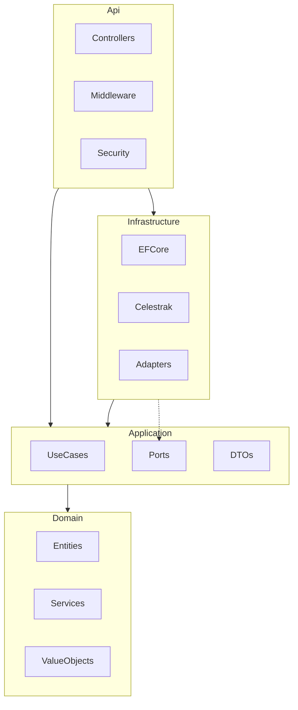
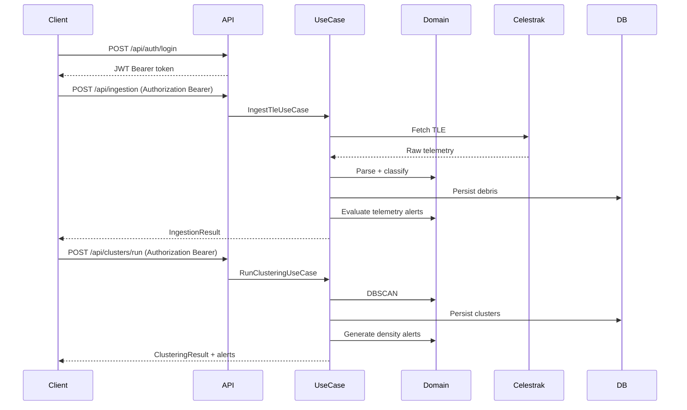

# Arquitetura - Garimpo Espacial Backend

## Visao geral

Mono-repo com backend em **ASP.NET Core 9**, **PostgreSQL 16**, **EF Core** e arquitetura **hexagonal**
(clean architecture). O dominio permanece isolado de frameworks; adapters na infraestrutura implementam
as portas definidas na aplicacao.

## Requisitos atendidos (disciplina Arquitetura)

| Requisito | Implementacao |
| --- | --- |
| Mono-repo + Docker Compose raiz | [`docker-compose.yml`](../../docker-compose.yml) orquestra db + backend + frontend |
| Compose por aplicacao | [`backend/docker-compose.yml`](../docker-compose.yml), [`frontend/docker-compose.yml`](../../frontend/docker-compose.yml) |
| Dockerfile por app | [`backend/Dockerfile`](../Dockerfile), [`frontend/Dockerfile`](../../frontend/Dockerfile) |
| Arquitetura hexagonal | 4 camadas: Domain, Application, Infrastructure, Api |
| Swagger | `/swagger` com documentacao OpenAPI |
| Heranca e polimorfismo | Hierarquia `SpaceAsset` → `OrbitalAsset` → `Satellite` / `DebrisAsset`; `SensorAsset`; `Alert` abstrato com subclasses |
| Classes abstratas | `SpaceAsset`, `OrbitalAsset`, `Alert` |
| Interfaces + DI | Portas `I*Repository`, `ITleProvider`, `ISensor`, `IClusteringService` |
| VO / DTO | `OrbitalElements`, `OrbitalCoordinate` (struct), DTOs na Application |
| Struct + Partial | `OrbitalCoordinate` (struct parcial), `Debris` (partial class para TLE) |
| WebService + Banco | API REST + PostgreSQL via EF Core |
| Tratamento de excecoes | Middleware `ExceptionHandlingMiddleware` → `ProblemDetails` |
| Evidencias de execucao | Secao [Evidencias de execucao](#evidencias-de-execucao) |

## Hierarquia de dominio (OOP)



## Camadas e dependencias



## Fluxo de dados



## Justificativas SOLID

- **SRP**: cada use case encapsula um fluxo (ingestao, clusterizacao, alertas).
- **OCP**: novos tipos de alerta via subclasses de `Alert` sem alterar `AlertEvaluationService`.
- **LSP**: `Satellite` e `DebrisAsset` substituem `OrbitalAsset` em calculos de risco.
- **ISP**: portas granulares (`IDebrisRepository`, `IAlertRepository`) em vez de repositorio monolitico.
- **DIP**: Application depende de abstracoes; Infrastructure implementa adapters.

## Endpoints

| Metodo | Rota | Auth | Descricao |
| --- | --- | --- | --- |
| POST | `/api/auth/register` | Publico | Registrar usuario |
| POST | `/api/auth/login` | Publico | Login e emissao JWT |
| POST | `/api/ingestion` | Bearer | Ingestao TLE |
| POST | `/api/clusters/run` | Bearer | DBSCAN |
| GET | `/api/clusters` | Bearer | Listar aglomerados |
| GET | `/api/debris` | Bearer | Listar detritos |
| GET | `/api/alerts` | Bearer | Listar alertas |
| POST | `/api/alerts/evaluate` | Bearer | Reavaliar alertas |
| POST | `/api/alerts/{id}/acknowledge` | Bearer | Reconhecer alerta |

## Evidencias de execucao

Ambiente validado em `2026-06-06` com `docker compose up --build` na raiz do mono-repo.

### Como reproduzir

```bash
sh scripts/setup-env.sh   # na raiz do mono-repo; depois edite os secrets no .env
docker compose up --build
```

- API: `http://localhost:8080`
- Swagger: `http://localhost:8080/swagger`
- App (frontend): `http://localhost:8081`

### Build e startup

```
dotnet build Garimpo.Backend.sln  -> Build succeeded. 0 Error(s)

Applying migration '20260606011510_InitialCreate'.
Migrations aplicadas com sucesso.
Now listening on: http://[::]:8080
```

### Swagger

```
GET /swagger/index.html -> 200
```

### Fluxo completo (API)

```
POST /api/ingestion?group=cosmos-2251-debris
-> {"fetched":588,"imported":588,"skipped":0}

POST /api/clusters/run {"epsilon":0.3,"minPoints":5}
-> {"processedDebris":588,"clustersFound":8,"noiseCount":77}

GET /api/clusters -> 8 aglomerados (maior densidade: ~4.3 em LEO ~760 km)
GET /api/debris    -> 588 detritos catalogados
GET /api/alerts    -> 6 alertas (2 Critical, demais Warning)
```

### Autenticacao JWT

```
POST /api/auth/login (fiap@teste.com / 123456) -> token JWT
GET /api/clusters (sem token) -> 401 Unauthorized
GET /api/clusters (com Bearer) -> 200 OK
Seed: usuario fiap@teste.com criado no startup
```

### Frontend integrado

Com a stack Docker ativa, o app em `http://localhost:8081` autentica via JWT, executa ingestao/pipeline no painel do analista, exibe graficos de clusters/detritos e lista alertas — consumindo os mesmos endpoints documentados acima.
